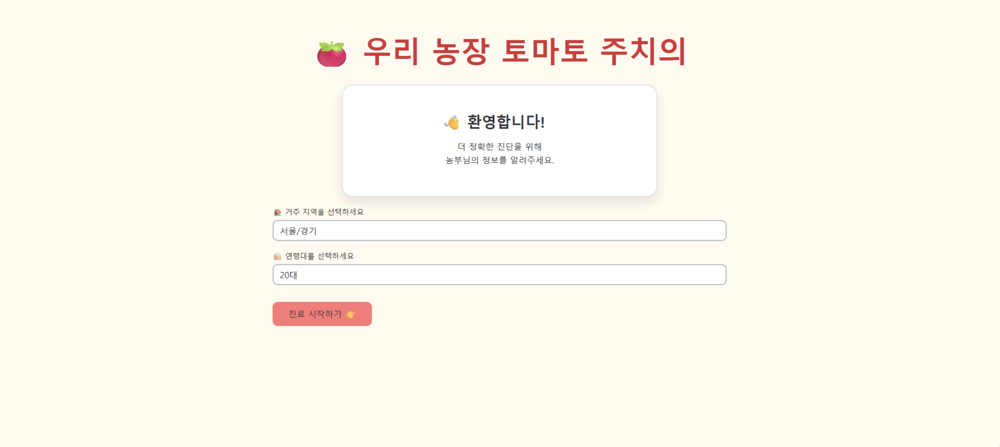
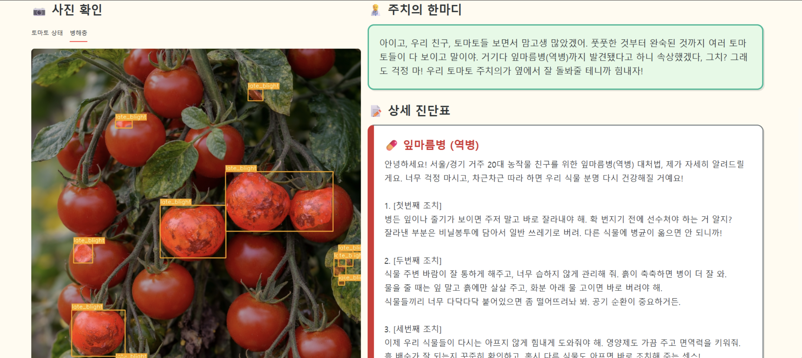

# 🍅 Tomato Segmentation PoC

토마토의 숙도(완숙/반숙/미숙)와 질병 병반을 Segmentation 모델로 정밀 탐지하고,  
분석 결과를 이미지 오버레이 및 직관적인 웹 UI로 제공하는 PoC 프로젝트입니다.

<table>
  <tr>
    <td align="center">
      
      <br />
      <b>📸 Web UI Input</b>
    </td>
    <td align="center">
      
      <br />
      <b>🔍 Segmentation Result</b>
    </td>
  </tr>
</table>

## 🚀 주요 기능
- **다중 클래스 탐지**: 숙도 3단계 + 주요 질병 병반 동시 분석
- **실시간 오버레이**: 원본 영상 위에 마스크를 합성하여 시각화
- **Web Dashboard**: 사용자 친화적인 분석 결과 모니터링
## 개요

- Laboro Tomato COCO를 3-class 숙도 라벨로 정리해 YOLOv8m-seg 학습.
- PlantSeg Tomato LabelMe를 7-class 질병 라벨로 변환해 YOLOv11m-seg 학습.
- MMSegmentation(SegNeXt) 파이프라인으로 질병 Segmentation 대안 학습.
- YOLO + SAM2로 질병 경계 보정 및 통합 시각화.
- Streamlit 앱으로 진단 UI 제공(ngrok 임시 공개 링크).

## 데이터셋

- Laboro Tomato (COCO instance segmentation): https://www.kaggle.com/datasets/nexuswho/laboro-tomato
  - 노트북에서 6클래스를 숙도 3클래스로 재매핑.
- PlantSeg Tomato subset (LabelMe polygons): https://zenodo.org/records/13762907
  - 토마토 질병 7클래스(예: bacterial_leaf_spot, early_blight, late_blight 등).

## 모델/기술

- YOLOv8m-seg: 숙도 Segmentation 학습.
- YOLOv11m-seg: 질병 Segmentation 학습.
- SegNeXt(MMSegmentation): 질병 Segmentation 대안.
- SAM2: 질병 경계 정밀 보정.
- Streamlit + ngrok: TomatoDoctor 웹 UI.

## 파이프라인

1. COCO/LabelMe 데이터를 YOLO/MMSegmentation 형식으로 변환.
2. 숙도 모델(YOLOv8m-seg)과 질병 모델(YOLOv11m-seg 또는 SegNeXt)을 독립 학습.
3. 추론 시 숙도 + 질병 결과를 하나의 이미지로 오버레이.
4. 샘플 결과 이미지를 `result/`에 저장.
5. Streamlit 앱에서 통합 진단 UI 제공(세션마다 URL 변경).

## 레포 구조

```
.
+-- notebook/
|   +-- Laboro_yolov8m.ipynb
|   +-- plantseg_yolov11.ipynb
|   +-- SegNeXt(MMSegmentation).ipynb
|   +-- TomatoDoctor(Lyolo+Pseg).ipynb
|   +-- Tomato_Final(Lyolo+Pyolo).ipynb
+-- result/
|   +-- IMG_0986_analyzed.png
|   +-- IMG_0987_analyzed.png
|   +-- IMG_0988_analyzed.png
|   +-- tomato_early_blight_1_analyzed.png
|   +-- jpg/
|       +-- IMG_0986_analyzed.jpg
|       +-- IMG_0987_analyzed.jpg
|       +-- IMG_0988_analyzed.jpg
|       +-- tomato_early_blight_1_analyzed.jpg
+-- LICENSE
+-- README.md
```

## 노트북 요약 (기능/결과)

| Notebook                                   | 기능                                                                          | 결과                                                             |
| ------------------------------------------ | ----------------------------------------------------------------------------- | ---------------------------------------------------------------- |
| `notebook/Laboro_yolov8m.ipynb`            | COCO 라벨 정리(3/4/5 → 0/1/2), 3클래스 YAML 생성, YOLOv8m-seg 학습            | 숙도 모델 `tomato_3class_REAL/weights/best.pt` 생성              |
| `notebook/plantseg_yolov11.ipynb`          | LabelMe → YOLO-seg 변환, 데이터 검증, YOLOv11m-seg 학습, SAM2 하이브리드 세그 | 샘플 진단 결과: `IMG_1011.jpg`에서 `Late Blight` 감지 및 시각화  |
| `notebook/SegNeXt(MMSegmentation).ipynb`   | LabelMe → MMSeg mask 변환, SegNeXt config 생성, 학습 실행                     | `work_dirs/segnext_tomato_final`에 체크포인트 생성               |
| `notebook/TomatoDoctor(Lyolo+Pseg).ipynb`  | YOLO 숙도 + SegNeXt 질병 모델을 Streamlit UI로 통합, Gemini 요약/대처 안내    | ngrok 공개 URL 출력(실행 시점마다 변경)                          |
| `notebook/Tomato_Final(Lyolo+Pyolo).ipynb` | YOLO 숙도/질병 + SAM2 정밀 분할 통합, 오버레이 이미지 저장                    | `/content/drive/MyDrive/cv2/analysis_results`에 분석 이미지 저장 |

## 결과

- 오버레이 PNG 결과는 `result/`에 저장됩니다.
- 동일 결과의 JPG는 `result/jpg/`에 보관됩니다.
- streamlit의 url 결과로 gemini의 안내를 받을 수 있습니다.
